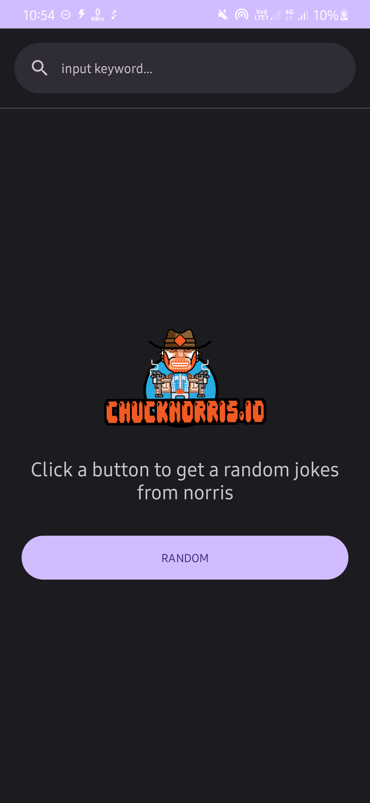
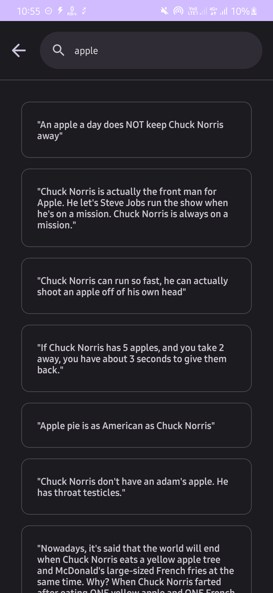

# Jokes-App

## Tech Stack & Libraries
Tech stack and libraries used
- MVVM (Model View ViewModel)
- API Client [Retrofit](https://square.github.io/retrofit/)
- Navigation Component
- Dependency Injection [Koin](https://insert-koin.io/)
- Logging Interceptor [Chucker Interceptor](https://github.com/ChuckerTeam/chucker)

## Public API
This project uses the public API
- [Chucknorris](https://api.chucknorris.io/)

## Screenshots

  
